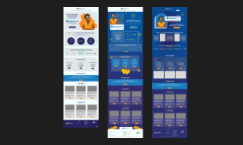
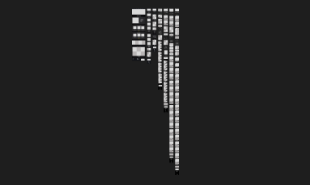
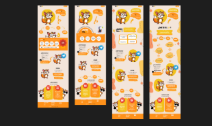

#   😃 Hi  I'm Ana and welcome to my github 
###

    

###

# 💻 Tech Stack:
                             

 

     
 
###

#  ⚙️ GitHub Analytics :

###

###
# 🎨 UI / UX: 

Here’s a portfolio with some of the mockups I've worked on using <strong>Figma</strong>, inspired by platforms like YouTube, Google, Pinterest, Dribbble, among others.  I’m sharing one of the designs I’m most proud of. 

<table>
  <tr>
    <td>
      
    </td>
    <td>
      
    </td>
    <td>
      
    </td>
  </tr>
</table>

###
# 🎓 Certifications & Diplomas  

A collection of certifications and diplomas I have obtained, showcasing my skills and achievements.

<li> <a href="DILATO_CERTIFICADO.pdf">[DILATO] Testing Entry Level Program Certificate</a></li>

